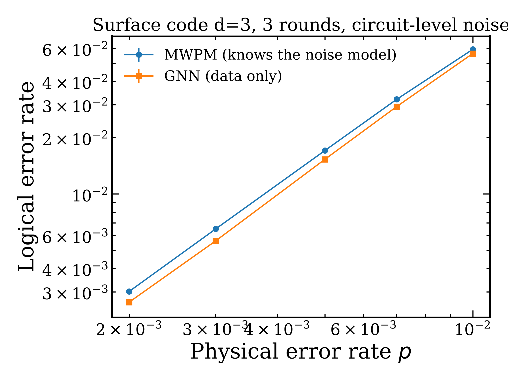

# A graph neural network decoder for the surface code

This project consist of a simplified reimplementation of the data-driven decoding idea of
[Lange et al., *Data-driven decoding of quantum error correcting codes using graph
neural networks*](https://arxiv.org/abs/2307.01241), trained on simulated data only generated using the Stim 
library with p ≤ 0.005.

**Result.** The main goal of this project is to demonstrate the advantage of Graph Neural Network in decoding distance-3 rotated surface code, with circuit-level noise, with respect to minimum-weight perfect matching (MWPM). 


| Decoder | Logical error rate (p = 0.005) |
|---|---|
| No decoder | 0.1040 ± 0.0007 |
| MWPM (PyMatching, exact noise model) | 0.01728 ± 0.00009 |
| **GNN (this work, data only)** | **0.01542 ± 0.00009** |

Using 2,000,000 test experiments with identical shots for both decoders the GNN presents an improvement **10.8%**, despite beeing trained using
only the measurement outcomes.


In addition the McNemar's significance test is applied to the results:

```
GNN right, MWPM wrong : 9238
GNN wrong, MWPM right : 5517
z = 30.6        p = 4e-206
```

In order to test the generalition power of the GNN, additional tests are performed generating two additional test samples with p = 0.007 and
p = 0.010. The overall performances for different values of p are here listed:

| p | MWPM | GNN | Improvement |
|---|---|---|---|
| 0.002 | 0.00301 | 0.00264 | 12.3% |
| 0.003 | 0.00651 | 0.00562 | 13.7% |
| 0.005 | 0.01705 | 0.01531 | 10.2% |
| 0.007 | 0.03204 | 0.02930 | 8.5% |
| 0.010 | 0.05928 | 0.05632 | 5.0% |



## The idea behind this project

A quantum computer cannot be read out mid-computation without destroying its state.
The surface code works around this by measuring *stabilizers*: parity checks on groups
of neighbouring qubits, repeated every round. A **detector** fires when the same
stabilizer gives a different answer in two consecutive rounds — evidence that something
went wrong in between, without revealing the encoded information.

Decoding means looking at which detectors fired and deciding whether the logical qubit
ended up flipped. MWPM does this by pairing up lit detectors at minimum cost, using edge
weights derived from a known noise model. The network is given no such model.

Each experiment becomes one graph:

- **nodes** = the detectors that fired, with features `(x, y, t)` — two space
  coordinates and the round, standardised
- **edges** = k = 6 nearest neighbours in that (x, y, t) space, symmetrised, with weight
  **1/distance**
- **graph-level label** = did the logical observable flip?

So the decoder is a binary classifier on a variable-size graph. Experiments where no
detector fires produce no graph at all: they are predicted "no flip" without asking the
network, and kept in the denominator so the numbers stay comparable with MWPM.


##Code structure

In this repository you can find the following scripts:

 `generate_data.py` | builds the Stim circuit and samples detectors, observables, coordinates 
 `baseline.py` | MWPM decoder via PyMatching, plus the "always predict 0" floor 
 `create_graphs.py` | one experiment → one `torch_geometric` graph (kNN edges, 1/distance weights) 
 `model.py` | hand-written message passing layer, mean pooling, GNN 
 `trainer.py` | training loop with fresh data each epoch 
 `evaluate.py` | logical error rate of a model, comparable with the baseline 
 `evaluate_final.py` | both decoders on identical shots, McNemar test, curve over p 

```bash
pip install stim pymatching torch torch_geometric pandas matplotlib
python baseline.py          # MWPM reference numbers
python trainer.py           # ~50 epochs, writes results/best_model.pt
python evaluate_final.py    # the numbers and the plot above
```

## Caveats and possible future works

- The GNN works on distance 3 only. The interesting regime for neural decoders is d ≥ 5, where the
  matching graph gets harder and the gap reported in the literature widens.
- Uniform circuit-level depolarising noise, so MWPM's noise model is *correct*; on real
  hardware it is not, which is where a data-driven decoder is expected to gain the most.
- Latency was measured but not optimised: graph construction runs in a Python loop at
  ~61 µs per experiment, against ~2 µs for network inference and 0.23 µs for batched
  MWPM. Real-time decoding needs the surface-code cycle time (~1 µs), so this
  implementation is an accuracy study, not a real-time decoder.

## References

- M. Lange, P. Havström, B. Srivastava, V. Bergentall, K. Hammar, O. Heuts, E. van Nieuwenburg, M. Granath,
  *Data-driven decoding of quantum error correcting codes using graph neural networks*,
  [arXiv:2307.01241](https://arxiv.org/abs/2307.01241) — [code](https://github.com/LangeMoritz/GNN_decoder)
- J. Bausch et al., *Learning high-accuracy error decoding for quantum processors* (AlphaQubit),
  [Nature 635 (2024)](https://www.nature.com/articles/s41586-024-08148-8)
- C. Gidney, *Stim: a fast stabilizer circuit simulator*, [arXiv:2103.02202](https://arxiv.org/abs/2103.02202)
- O. Higgott, C. Gidney, *Sparse Blossom: correcting a million errors per core second*,
  [arXiv:2303.15933](https://arxiv.org/abs/2303.15933)
- E. Dennis, A. Kitaev, A. Landahl, J. Preskill, *Topological quantum memory*,
  [quant-ph/0110143](https://arxiv.org/abs/quant-ph/0110143)
